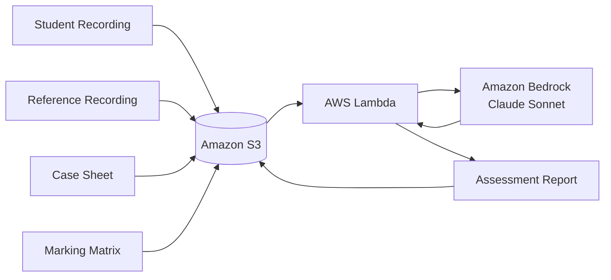
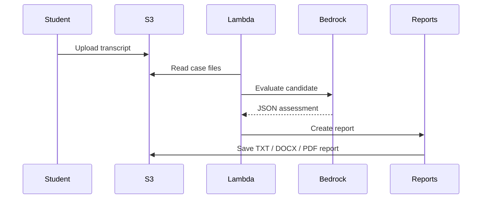
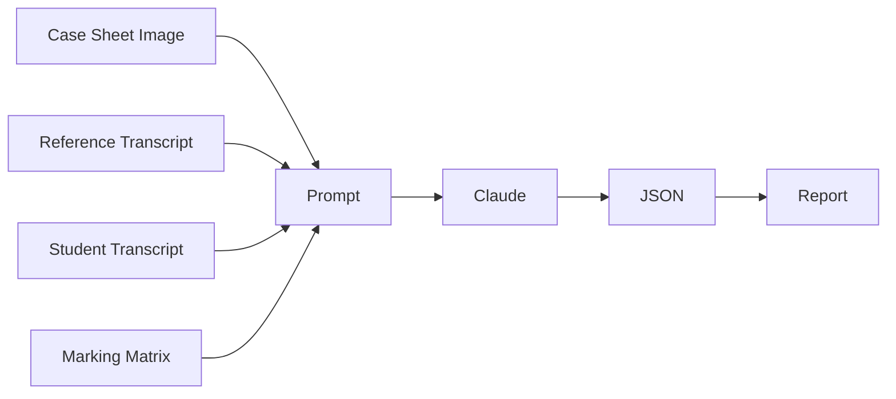
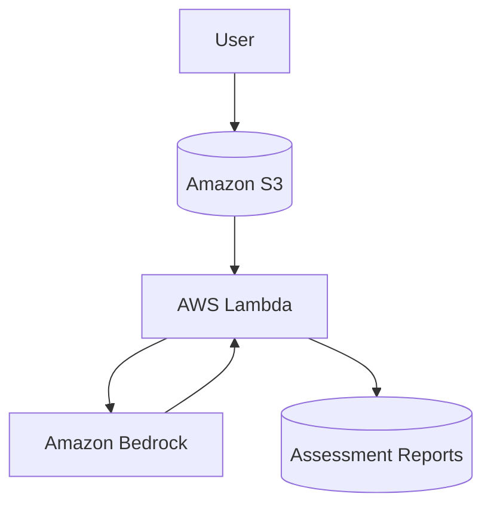
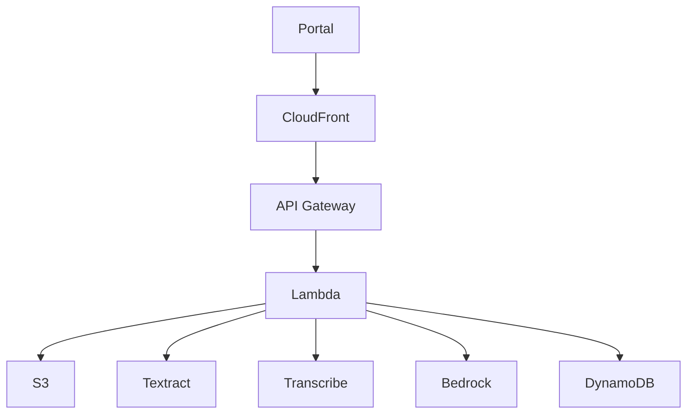

# 🦷 Dental AI Tutor

An AI-powered examiner assistant that evaluates dental student case presentations against a reference solution and official marking rubric.

Built entirely on AWS using Amazon Bedrock, AWS Lambda and Amazon S3.

> Designed for UK ORE-style examinations and structured clinical assessments.

---

## 🚀 Features

- ✅ AI examiner using Claude Sonnet (Amazon Bedrock)
- ✅ Evaluates student transcripts against a reference answer
- ✅ Reads multimodal case sheets (images + text)
- ✅ Uses official marking matrix/rubric
- ✅ Scores every assessment criterion
- ✅ Detects confidence, hesitation and filler language
- ✅ Generates examiner-style feedback
- ✅ Stores reports back into Amazon S3
- ✅ Serverless AWS architecture

---

## 🏗️ Solution Architecture



---

## 🔄 End-to-End Workflow



---

## 🧠 AI Evaluation Pipeline



---

## ☁️ AWS Architecture



---

## 📁 Repository Structure

```text
dental-ai-tutor/

├── lambda/
│   └── lambda_function.py
│
├── cases/
│   ├── case1/
│   │   ├── case-study.jpeg
│   │   ├── marking-matrix.txt
│   │   ├── reference-transcript.json
│   │   └── student1-transcript.json
│   │
│   └── reports/
│       └── case1/
│           └── student-outcome-report.txt
│
└── README.md
```

---

## 📋 Assessment Inputs

For each case the solution consumes:

### Case Sheet

Contains:

- Clinical scenario
- Patient details
- Radiographs/images
- Examination findings
- Additional information required for diagnosis

### Marking Matrix

Contains:

- Assessment criteria
- Scoring framework
- Pass/fail expectations
- Examiner guidance

### Reference Transcript

A model answer demonstrating:

- Correct diagnosis
- Clinical reasoning
- Patient communication
- Appropriate treatment planning

### Student Transcript

Generated from:

- Audio recording
- Manual transcription
- Amazon Transcribe (future enhancement)

---

## 📊 Example Output

```json
{
  "overall_score": 68,
  "overall_grade": "MEETS STANDARD",
  "confidence_score": 55,
  "strengths": [
    "Correct diagnosis",
    "Safe clinical management"
  ],
  "areas_for_improvement": [
    "Reduce filler language",
    "Improve confidence"
  ]
}
```

---

## ⚙️ Deployment

### Prerequisites

- AWS Account
- Amazon Bedrock access
- Claude Sonnet model enabled
- Amazon S3 bucket
- AWS Lambda

---

### Step 1 - Create S3 Bucket

```text
planore-ai-tutor-dev
```

---

### Step 2 - Upload Case Files

```text
case1/

├── case-study.jpeg
├── marking-matrix.txt
├── reference-transcript.json
└── student1-transcript.json
```

---

### Step 3 - Create Lambda Function

Runtime:

```text
Python 3.13
```

Memory:

```text
1024 MB
```

Timeout:

```text
120 Seconds
```

---

### Step 4 - Configure Environment Variables

| Variable | Description |
|-----------|-------------|
| BUCKET_NAME | S3 bucket name |
| MODEL_ID | Bedrock model ID |
| REGION | AWS Region |

Example:

```text
BUCKET_NAME=planore-ai-tutor-dev
MODEL_ID=us.anthropic.claude-sonnet-4-6
REGION=us-east-1
```

---

### Step 5 - IAM Permissions

Minimum permissions:

```json
{
  "Version":"2012-10-17",
  "Statement":[
    {
      "Effect":"Allow",
      "Action":[
        "s3:GetObject",
        "s3:PutObject"
      ],
      "Resource":"*"
    },
    {
      "Effect":"Allow",
      "Action":[
        "bedrock:InvokeModel"
      ],
      "Resource":"*"
    }
  ]
}
```

---

### Step 6 - Test Event

```json
{
  "caseId": "case1",
  "studentId": "student1"
}
```

---

## 📄 Generated Reports

Reports are written back to S3.

Example:

```text
cases/reports/case1/student-outcome-report.txt
```

Report contents include:

- Overall Score
- Grade
- Criterion-by-Criterion Scoring
- Strengths
- Areas for Improvement
- Confidence Assessment
- Final Examiner Feedback

---

## 🎯 Educational Objectives

The platform helps students:

- Improve communication skills
- Improve diagnostic reasoning
- Improve treatment planning
- Reduce hesitation and filler language
- Increase confidence in clinical presentations
- Prepare for ORE examinations

---

## 🛣️ Roadmap

### Phase 1 (Current MVP)

- Case image evaluation
- Reference transcript comparison
- Student transcript assessment
- Examiner-style scoring
- S3 report generation

### Phase 2

- Amazon Transcribe integration
- DOCX report generation
- PDF report generation
- Student portal

### Phase 3

- Knowledge Base (RAG)
- Multi-case management
- Student dashboard
- Progress tracking
- Historical analytics

### Phase 4

- Authentication
- Multi-tenancy
- Faculty dashboard
- Batch assessments
- Learning recommendations

---

## 🔮 Future Architecture



---

## 💰 Cost Considerations

Typical MVP costs:

| Service | Estimated Cost |
|----------|----------------|
| S3 | Very low |
| Lambda | Minimal |
| CloudWatch | Minimal |
| Bedrock Claude | Pay per request |

Most costs are driven by Bedrock model inference.

---

## 🔐 Security

Recommended controls:

- Least-privilege IAM roles
- S3 encryption
- HTTPS/TLS everywhere
- CloudWatch audit logging
- Secure handling of student data
- Version-controlled infrastructure

---

## 🤝 Contributing

Contributions are welcome.

Potential areas:

- Prompt engineering
- Report generation
- UI development
- Infrastructure as Code
- Assessment analytics

---

## 📜 License

MIT License

---

## 👨‍⚕️ Disclaimer

This project is intended for educational assessment and training purposes only.

It is not intended to provide clinical advice, diagnosis or treatment recommendations for real patients.
