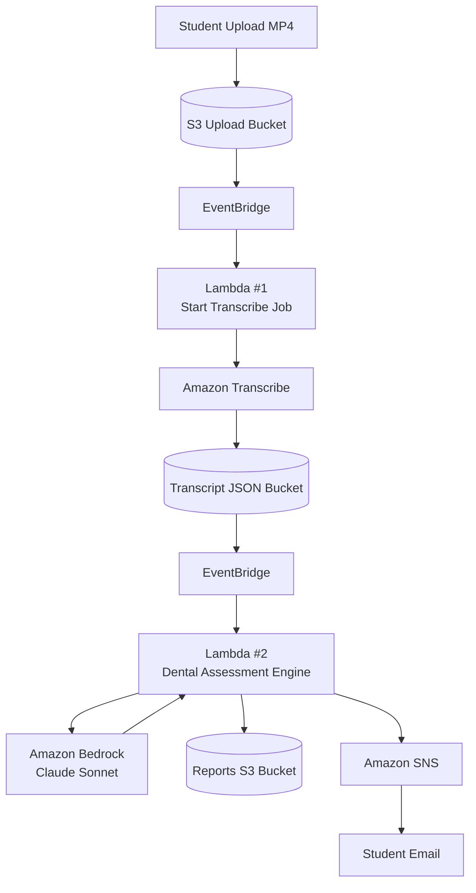
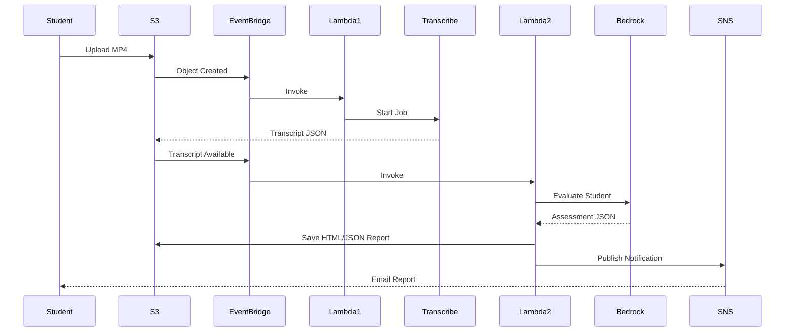
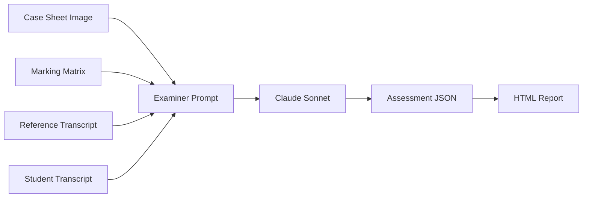
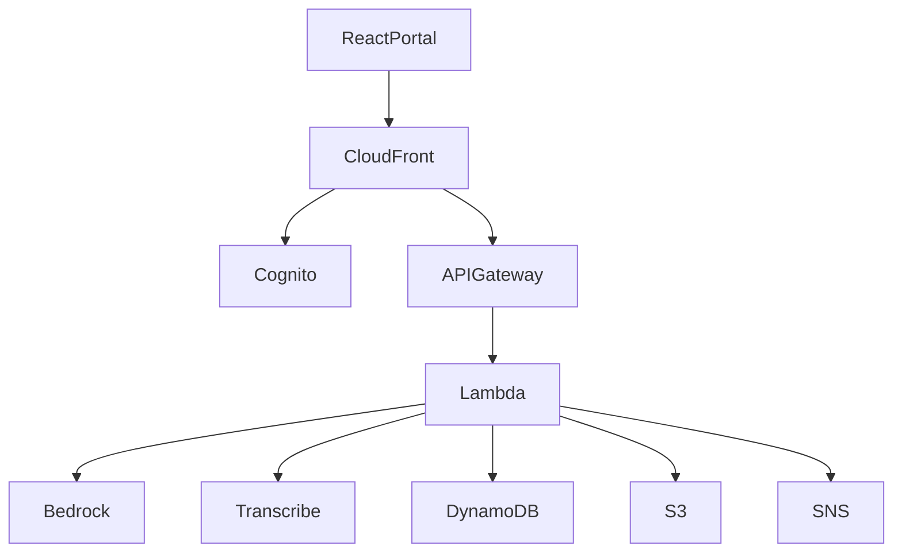

# 🦷 Dental AI Tutor

> AI-powered dental examination assessment platform built on AWS that automatically transcribes student presentations, evaluates performance against reference answers and official marking rubrics, generates examiner-style reports, and emails feedback to students.

---

# 📚 Table of Contents

- Overview
- Business Problem
- Solution Overview
- End-to-End Architecture
- Processing Workflow
- AWS Services
- Repository Structure
- S3 Bucket Structure
- Assessment Pipeline
- Report Generation
- Email Delivery
- Deployment Guide
- IAM Permissions
- Monitoring & Observability
- Security
- Cost Considerations
- Future Enhancements
- Production Architecture

---

# 🎯 Overview

Dental AI Tutor is designed to help dental students prepare for ORE-style examinations and clinical assessments.

The platform:

1. Accepts a student MP4 recording.
2. Automatically transcribes speech using Amazon Transcribe.
3. Compares the student's performance against:
   - Case Sheet
   - Clinical Images
   - Reference Transcript
   - Official Marking Matrix
4. Evaluates clinical reasoning and communication.
5. Generates examiner-style scoring and feedback.
6. Stores reports in Amazon S3.
7. Sends results to students via email using Amazon SNS.

---

# ❓ Business Problem

Manual evaluation of clinical case presentations is:

- Time-consuming
- Difficult to scale
- Subject to examiner variation
- Expensive for training providers

Dental AI Tutor provides:

- Consistent evaluation
- Immediate feedback
- Scalable assessments
- Confidence analysis
- Standardised marking

---

# 🏗️ End-to-End Architecture



---

# 🔄 Sequence Diagram



---

# 🧠 Assessment Pipeline



---

# ☁️ AWS Services

| Service | Purpose |
|----------|----------|
| Amazon S3 | File storage |
| Amazon EventBridge | Event routing |
| AWS Lambda | Serverless processing |
| Amazon Transcribe | Speech-to-text |
| Amazon Bedrock | AI evaluation |
| Amazon SNS | Email delivery |
| Amazon CloudWatch | Logging & monitoring |
| AWS IAM | Security |
| AWS KMS | Encryption |

---

# 📁 Repository Structure

```text
dental-ai-tutor/

├── README.md
│
├── docs/
│   ├── architecture/
│   ├── diagrams/
│   └── screenshots/
│
├── lambda/
│   ├── transcribe-trigger/
│   │   └── lambda_function.py
│   │
│   └── assessment-engine/
│       └── lambda_function.py
│
├── prompts/
│   └── examiner-prompt.txt
│
├── cases/
│   ├── case1/
│   │   ├── case-sheet.jpeg
│   │   ├── marking-matrix.txt
│   │   └── reference-transcript.json
│   │
│   └── case2/
│
├── infrastructure/
│   ├── terraform/
│   ├── cloudformation/
│   └── sam/
│
└── reports/
```

---

# 🪣 S3 Bucket Structure

```text
planore-ai-tutor-dev/

cases/
│
├── case1/
│   ├── case-study.jpeg
│   ├── marking-matrix.txt
│   └── reference-transcript.json
│
student-uploads/
│
├── case1/
│   ├── student1.mp4
│   ├── student2.mp4
│   └── student3.mp4
│
transcripts/
│
├── case1/
│   ├── student1-transcript.json
│   └── student2-transcript.json
│
reports/
│
├── case1/
│   ├── student1-report.html
│   ├── student1-report.json
│   └── student1-report.pdf
```

---

# 📥 Upload Flow

Students upload recordings:

```text
student-uploads/case1/student1.mp4
```

Supported formats:

- MP4
- MP3
- WAV
- M4A

---

# 🎤 Transcription Flow

Lambda #1:

Responsibilities:

- Validate upload
- Create Transcribe Job
- Track status
- Save transcript JSON

Output:

```text
transcripts/case1/student1-transcript.json
```

---

# 🧾 Assessment Flow

Lambda #2 loads:

- Case Sheet Image
- Marking Matrix
- Reference Transcript
- Student Transcript

The prompt is sent to Claude Sonnet.

Evaluation criteria may include:

- History Taking
- Diagnosis
- Differential Diagnosis
- Treatment Planning
- Communication Skills
- Professionalism
- Empathy
- Confidence
- Clinical Safety
- Time Management

---

# 📊 Example Assessment Output

```json
{
  "overall_score": 68,
  "overall_grade": "MEETS STANDARD",
  "confidence_score": 55,
  "strengths": [
    "Correct diagnosis"
  ],
  "areas_for_improvement": [
    "Reduce filler language"
  ]
}
```

---

# 📄 Report Generation

Generated formats:

### JSON

Machine-readable output

### HTML

Student-friendly assessment report

### PDF

Optional future enhancement

Example location:

```text
reports/case1/student1-report.html
```

---

# 📧 Email Delivery

SNS Topic:

```text
dental-ai-assessment-topic
```

Email includes:

- Assessment summary
- Score
- Confidence score
- Strengths
- Areas for improvement
- Link to detailed report

---

# 🚀 Deployment Steps

## Step 1

Create S3 bucket

## Step 2

Create EventBridge rule for uploads

## Step 3

Deploy Transcribe Lambda

## Step 4

Create EventBridge rule for transcript creation

## Step 5

Deploy Assessment Lambda

## Step 6

Configure Bedrock model access

## Step 7

Create SNS Topic and Email Subscription

## Step 8

Test end-to-end workflow

---

# 🔐 IAM Permissions

## Lambda #1

Required:

- s3:GetObject
- s3:PutObject
- transcribe:StartTranscriptionJob
- transcribe:GetTranscriptionJob

## Lambda #2

Required:

- s3:GetObject
- s3:PutObject
- bedrock:InvokeModel
- sns:Publish

---

# 📈 Monitoring & Observability

CloudWatch Metrics:

- Upload Count
- Transcription Count
- Assessment Count
- Failed Assessments
- Lambda Duration
- Bedrock Invocations
- Email Delivery Count

CloudWatch Alarms:

- Lambda Failures
- High Error Rate
- Bedrock Invocation Errors
- SNS Delivery Failures

---

# 🔒 Security

Recommended controls:

- IAM Least Privilege
- S3 Encryption
- KMS Keys
- CloudWatch Auditing
- Versioned Buckets
- Lifecycle Policies
- Private Buckets
- HTTPS/TLS Everywhere

---

# 💰 Cost Considerations

Primary cost drivers:

1. Amazon Bedrock
2. Amazon Transcribe
3. AWS Lambda
4. Amazon SNS
5. Amazon S3

For a pilot deployment with tens of students per day, costs are typically modest and scale with usage.

---

# 🛣️ Roadmap

## Phase 1 (Current)

- MP4 Upload
- Automatic Transcription
- AI Assessment
- HTML Reports
- Email Delivery

## Phase 2

- PDF Reports
- Student Portal
- Faculty Dashboard
- Progress Tracking

## Phase 3

- Bedrock Knowledge Base
- RAG Architecture
- Trend Analysis
- Learning Recommendations

## Phase 4

- Cognito Authentication
- Multi-Tenant Platform
- Institution Administration
- Analytics Dashboard

---

# 🔮 Production Architecture



---

# ⚠️ Disclaimer

This platform is intended for educational assessment and training purposes only and is not intended to provide clinical advice or treatment recommendations.
